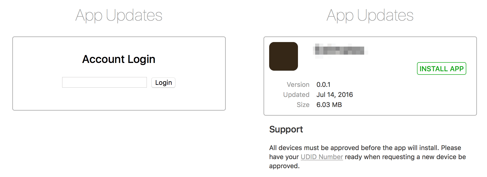

# iOS AdHoc

A super simple way to distribute your ad hoc builds to authorized devices over the web.

Simply drag & drop your ad hoc ipa files to a sub-folder inside the `web/apps` directory and watch the app name, icon, and installation manifest be created from your app's ipa file.

If you want to release a new build, delete the app's ipa, png, and plist files and upload the new ipa file. (The web app will recreate the png and plist files automatically.)

You can create multiple folders (see Passwords below) for developers, testers, and end users.

## Screenshots

## Requirements
- Apache Web Server
- SSL Certificate (Not self-signed, iOS Requirement)
- PHP 5.4+
- Composer

## Installation

1. [Download](https://github.com/d3designs/iOS-AdHoc/archive/master.zip) a fresh copy
2. Install the [composer](https://getcomposer.org) dependencies with `composer install`
3. Create as many "password" sub-directories as you'd like in the `web/apps/` folder. (e.g. `web/apps/my-password/`)
4. Copy your ipa files to the created sub-directory
5. Point your Apache server to the `web/` directory
6. Login using your created folder name. (e.g. *my-password*)
7. Profit!

## Passwords
Passwords are simply the sub-directories under the apps folder. These *passwords* are saved in the auto-generated `src/_passwords.php` file. If you change the sub-directories in the apps folder, you will want to delete this file so it will be recreated.

## Image Assets
Most of the images in the `web/img/` directory are self explanatory, but there are two images that need special attention.

- `web/img/default-display-image.png` Is the default app icon used on the site and when installing the app. The default icon is used if an icon couldn't be extracted from the app's ipa file.
- `web/img/default-full-size-image.png` Is the default iTunes store icon which is required for the over the air installation manifest plist.

## Acknowledgements
The initial ipa extraction code was created by [Federico Mestrone's iOS-AdHoc](https://github.com/fmestrone/iOS-AdHoc) project. Base HTML template and images are from the [HTML5 Boilerplate](https://html5boilerplate.com) project.

## License
The code is available under the [MIT license](LICENSE.md).
